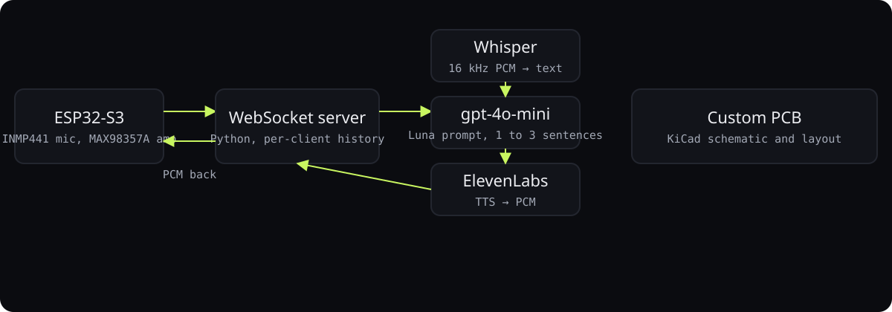

<div align="center">

# Luno voice assistant

**A kids' voice assistant on a $10 microcontroller: ESP32-S3 streams audio to a server that runs Whisper, ChatGPT, and ElevenLabs and streams PCM back.**

<p>
<a href="https://ibiraheel.com/p/luno"></a>
</p>

<p>


</p>

</div>

<br>

> **Full voice loop on an ESP32-S3**  
> for children aged 4 to 10, and a hardware startup pitch built around it

## What it did

Press the button, talk, hear Luna answer through a 3-watt speaker. Firmware handles I2S mic and amp; the Python server handles transcription, a child-safe prompt, and TTS converted to PCM for easy playback. Custom PCB designed in KiCad.

<sub>Outcome: illustrative.</sub>

## How it works

<p align="center"></p>

1. WebSocket instead of HTTP so audio streams both ways without buffering a whole clip.
2. PCM output instead of MP3 removes the decoder from the microcontroller.
3. Conversation history per client so follow-up questions work.
4. System prompt limits replies to one to three sentences because this is a voice channel.
5. Hardware: INMP441 mic, MAX98357A amp, one button; schematic and PCB in KiCad.

## Hardware Required

- **ESP32-S3 DevKit** (or similar ESP32-S3 board)
- **INMP441** I2S MEMS Microphone
- **MAX98357A** I2S Amplifier + Speaker (3W or 5W)
- Push button (or use BOOT button on GPIO 0)
- Optional: LED for status indication

## Wiring Diagram

### INMP441 Microphone → ESP32-S3
| INMP441 | ESP32-S3 |
|---------|----------|
| VDD     | 3.3V     |
| GND     | GND      |
| SD      | GPIO 15  |
| WS      | GPIO 16  |
| SCK     | GPIO 17  |
| L/R     | GND      |

### MAX98357A Amplifier → ESP32-S3
| MAX98357A | ESP32-S3 |
|-----------|----------|
| VIN       | 5V       |
| GND       | GND      |
| DIN       | GPIO 18  |
| BCLK      | GPIO 45  |
| LRC       | GPIO 46  |
| GAIN      | NC       |
| SD        | NC or 3.3V |

### Button
| Button | ESP32-S3 |
|--------|----------|
| Pin 1  | GPIO 0   |
| Pin 2  | GND      |

## Project Structure

```
Luno_Websocket/
├── backend/
│   ├── server.py           # Main server (MP3 audio)
│   ├── server_pcm.py       # PCM audio version (recommended)
│   ├── requirements.txt    # Python dependencies
│   ├── .env.example        # Environment template
│   └── .env                # Your API keys (create this)
│
├── esp32/
│   ├── KidsVoiceAssistant/           # MP3 version
│   │   └── KidsVoiceAssistant.ino
│   │
│   └── KidsVoiceAssistant_PCM/       # PCM version (recommended)
│       └── KidsVoiceAssistant_PCM.ino
│
└── README.md
```

## Setup Instructions

### 1. Backend Setup

```bash
# Navigate to backend folder
cd backend

# Create virtual environment (optional but recommended)
python3 -m venv venv
source venv/bin/activate  # On Windows: venv\Scripts\activate

# Install dependencies
pip install -r requirements.txt

# Copy and edit environment file
cp .env.example .env
```

Edit `.env` with your API keys:
```
OPENAI_API_KEY=sk-your-openai-key-here
ELEVENLABS_API_KEY=your-elevenlabs-key-here
ELEVENLABS_VOICE_ID=21m00Tcm4TlvDq8ikWAM
```

**Install FFmpeg** (required for PCM version):
- macOS: `brew install ffmpeg`
- Ubuntu/Debian: `sudo apt install ffmpeg`
- Windows: Download from https://ffmpeg.org/

### 2. Arduino/ESP32 Setup

**Install Arduino IDE libraries:**
1. Open Arduino IDE
2. Go to **Tools → Manage Libraries**
3. Install:
   - `WebSockets` by Markus Sattler
   - `ArduinoJson` by Benoit Blanchon

**Configure the board:**
1. Go to **File → Preferences**
2. Add ESP32 board URL: `https://raw.githubusercontent.com/espressif/arduino-esp32/gh-pages/package_esp32_index.json`
3. Go to **Tools → Board → Boards Manager**
4. Install "esp32" by Espressif
5. Select **Tools → Board → ESP32S3 Dev Module**

**Configure the code:**
1. Open `esp32/KidsVoiceAssistant_PCM/KidsVoiceAssistant_PCM.ino`
2. Edit these lines at the top:
```cpp
const char* WIFI_SSID = "YOUR_WIFI_SSID";
const char* WIFI_PASSWORD = "YOUR_WIFI_PASSWORD";
const char* WS_HOST = "192.168.1.100";  // Your computer's IP
```

3. Upload to ESP32-S3

### 3. Find Your Computer's IP

- **macOS**: `ifconfig | grep "inet " | grep -v 127.0.0.1`
- **Windows**: `ipconfig` (look for IPv4 Address)
- **Linux**: `ip addr show | grep "inet "`

Use this IP in the Arduino code for `WS_HOST`.

### 4. Running the System

**Terminal 1 - Start the backend:**
```bash
cd backend
python server_pcm.py
```

You should see:
```
╔══════════════════════════════════════════════════════════════╗
║       Kids Voice Assistant - Backend Server (PCM)            ║
╠══════════════════════════════════════════════════════════════╣
║  WebSocket Server: ws://0.0.0.0:8765                         ║
║  Audio Format: PCM 16-bit, 16kHz, Mono                       ║
╚══════════════════════════════════════════════════════════════╝
✅ FFmpeg found
✅ Configuration validated
✅ Server running on ws://0.0.0.0:8765

📱 Waiting for ESP32 connection...
```

**ESP32:**
1. Power on or reset the ESP32
2. Open Serial Monitor (115200 baud) to see status
3. Wait for "Ready! Hold button to speak."

### 5. Usage

1. **Press and hold** the button to start recording
2. **Speak** your question
3. **Release** the button when done
4. Wait for the response to play through the speaker

## Troubleshooting

### ESP32 won't connect to WiFi
- Check SSID and password
- Ensure 2.4GHz network (ESP32 doesn't support 5GHz)
- Try moving closer to the router

### WebSocket connection fails
- Verify the server is running
- Check the IP address in Arduino code
- Ensure both devices are on the same network
- Check firewall isn't blocking port 8765

### No audio from microphone
- Check INMP441 wiring (SD, WS, SCK pins)
- Ensure L/R pin is connected to GND for left channel
- Try increasing the gain multiplier in code

### No audio from speaker
- Check MAX98357A wiring
- Ensure VIN is connected to 5V (not 3.3V)
- SD pin can be left floating or tied to 3.3V

### Audio quality issues
- Reduce ambient noise
- Speak clearly and at normal volume
- Check for loose wiring connections

## API Keys

### OpenAI
1. Go to https://platform.openai.com/api-keys
2. Create a new API key
3. Add to `.env` as `OPENAI_API_KEY`

### ElevenLabs
1. Go to https://elevenlabs.io/
2. Sign up for an account
3. Go to Profile → API Keys
4. Copy your API key to `.env` as `ELEVENLABS_API_KEY`

### Voice IDs
Popular ElevenLabs voice options:
- `21m00Tcm4TlvDq8ikWAM` - Rachel (warm female, default)
- `EXAVITQu4vr4xnSDxMaL` - Bella (young female)
- `MF3mGyEYCl7XYWbV9V6O` - Elli (young female)
- `TxGEqnHWrfWFTfGW9XjX` - Josh (young male)

## Customization

### Change the AI personality
Edit the `SYSTEM_PROMPT` in `server_pcm.py`:
```python
SYSTEM_PROMPT = """You are [Your Character Name], a friendly assistant..."""
```

### Adjust audio gain
In the Arduino code, find the recording section and modify the gain:
```cpp
int32_t s = buffer[i] * 4;  // Change 4 to higher/lower value
```

### Change I2S pins
Modify the pin definitions at the top of the Arduino code if needed.

## License

MIT License - Feel free to modify and use in your projects!

---

<div align="center">

<sub>Built by <a href="https://github.com/ibi-raheel">Muhammad Ibrahim Raheel</a> · more work at <a href="https://ibiraheel.com">ibiraheel.com</a></sub>

</div>
